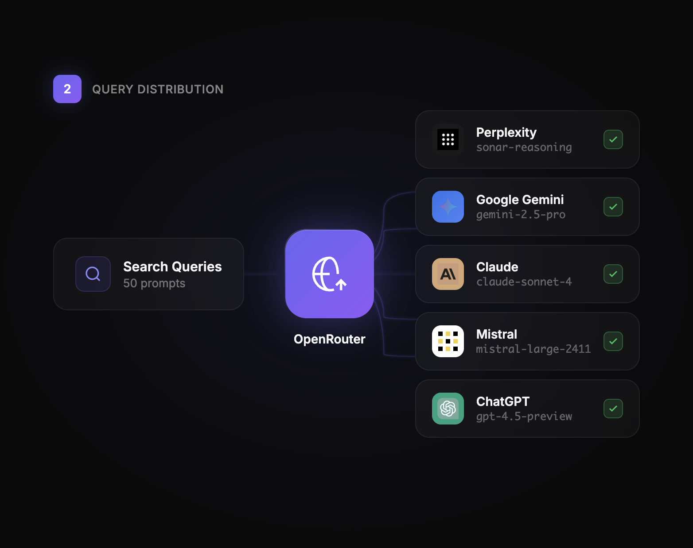

# OpenFigma

Open-source Figma-style design system for AI/ML pipeline diagrams. Dark theme, glassmorphism, YC/Cursor-level aesthetics.



## ✨ Features

- **Dark mode first** - #0a0a0b background
- **Glassmorphism** - `backdrop-filter: blur(20px)` cards
- **Gradient accents** - Purple → Green → Orange color progression
- **Animated connections** - Pulsing SVG flow lines
- **Real brand logos** - AI platform icons (Perplexity, Gemini, Claude, Mistral, ChatGPT)
- **Self-contained HTML** - No build tools required

## 📁 Structure

```
openfigma/
├── diagrams/           # HTML source files
│   ├── diagram-1-cursor-style.html   # Context Analysis (Brain)
│   ├── diagram-2-cursor-style.html   # Query Distribution (OpenRouter)
│   ├── diagram-3-cursor-style.html   # Data Aggregation (Database)
│   └── diagram-4-cursor-style.html   # Content Generation (Article)
├── exports/            # High-res PNG exports
│   ├── cursor-style-1-brain.png
│   ├── cursor-style-2-openrouter.png
│   ├── cursor-style-3-database.png
│   └── cursor-style-4-article.png
└── assets/             # Additional resources
```

## 🎨 Design System

### Colors
```css
--background: #0a0a0b
--card-bg: rgba(255, 255, 255, 0.03)
--card-border: rgba(255, 255, 255, 0.06)
--text-primary: #f5f5f5
--text-muted: rgba(255, 255, 255, 0.4)

/* Accent gradients */
--purple: linear-gradient(135deg, #6366f1, #8b5cf6)
--green: linear-gradient(135deg, #22c55e, #16a34a)
--orange: linear-gradient(135deg, #f97316, #ea580c)
```

### Typography
- **Font**: Inter (400, 500, 600, 700)
- **Monospace**: SF Mono / Monaco (for model versions)

### Components
- Glassmorphism cards with hover states
- Gradient center nodes with glow effects
- AI platform logo badges
- Animated SVG connection lines
- Step badges with labels

## 🚀 Usage

### View in Browser
Simply open any HTML file directly:
```bash
open diagrams/diagram-1-cursor-style.html
```

### Export to PNG/PDF
1. Open HTML in browser
2. Right-click → Print → Save as PDF
3. Or use browser screenshot tools

### Customize
Edit the HTML/CSS directly - everything is self-contained with inline styles.

## 📸 Diagrams

| # | Name | Description |
|---|------|-------------|
| 1 | **Brain** | Context analysis: Website + Competitors → Target Personas + Search Queries |
| 2 | **OpenRouter** | Query distribution: Search Queries → AI Models (5 platforms) |
| 3 | **Database** | Data aggregation: AI responses → Mentions, Competitors, Context |
| 4 | **Article** | Content generation: Database + Crawl + Research → AEO Article |

## 🤖 AI Models Shown

| Platform | Model | Logo |
|----------|-------|------|
| Perplexity | sonar-reasoning | ✅ |
| Google Gemini | gemini-2.5-pro | ✅ |
| Claude | claude-sonnet-4 | ✅ |
| Mistral | mistral-large-2411 | ✅ |
| ChatGPT | gpt-4.5-preview | ✅ |

## 📄 License

MIT - Use freely for your own projects.

---

Made with ❤️ by SCAILE

